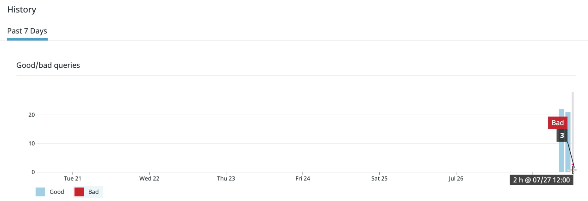

# Modeling failure in our systems

Let's start introducing errors by switching images! This will allow us to explore what happens to our SLO's status and error budget. 
 
In a real world scenario, a popular e-commerce site will receive a lot of traffic and there is eventually going to be some errors introduced in the application for various reasons. For now we are dealing with our hypothetical web store. 

Before we switch images, be sure to go back into the storedog application and perform more operations on your cart to increase the total number of requests!

After your done, close all storedog tabs that you have open.
 
In the terminal window where you currently have docker-compose running, press CTRL + C to stop the command. Wait a few seconds for the process to gracefully terminate.

Now enter a new docker-compose command with your `<api key>` using the broken image like so:

`DD_API_KEY=<api key> docker-compose -f docker-compose-broken-instrumented.yml up`

Wait a few minutes until the application has fully started again.
 
Try going back to the storedog homepage, selecting a product and adding it to your cart. What happens when you do this? You should be getting a NoMethodExists error, although in the real world this could have been any error that causes the add item request to fail. Press the back button in your browser and try adding other items to your cart to induce more errors.
 
Go back to the SLO details page. What do you see now? Your SLO status and error budget should no longer be 100% anymore 

## Replace 
 
Try hovering over the different colored bars in the bar graph and you'll be able to see a count of good and bad events that occurred at a given time: 

## Replace 

Over time if these errors were to continue at a high pace, our error budget would quickly deplete and we might be at risk of breaching our Service Level Agreements (SLAs) with customers. By being diligent with creating and managing SLOs we can uncover user experience issues and take action to resolve them quickly!
